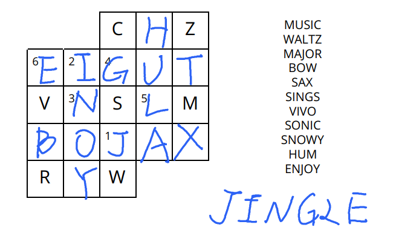
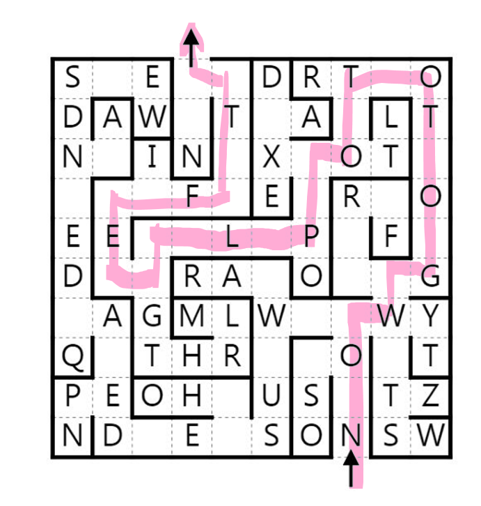
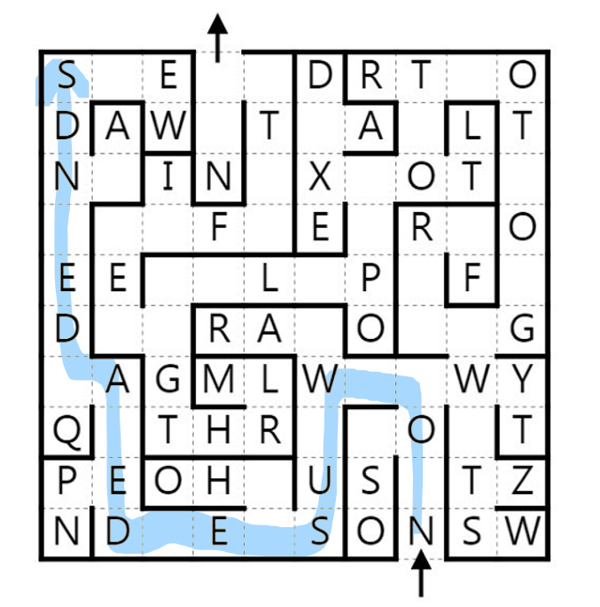
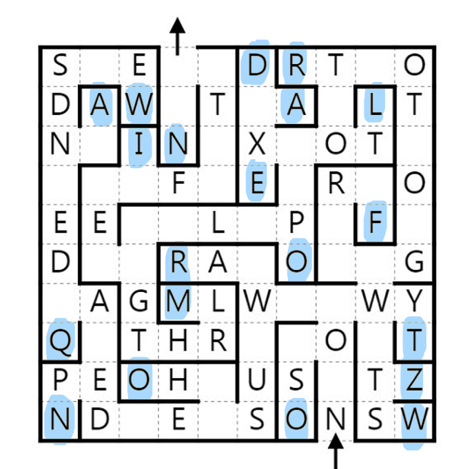
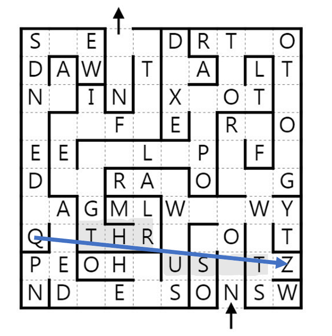
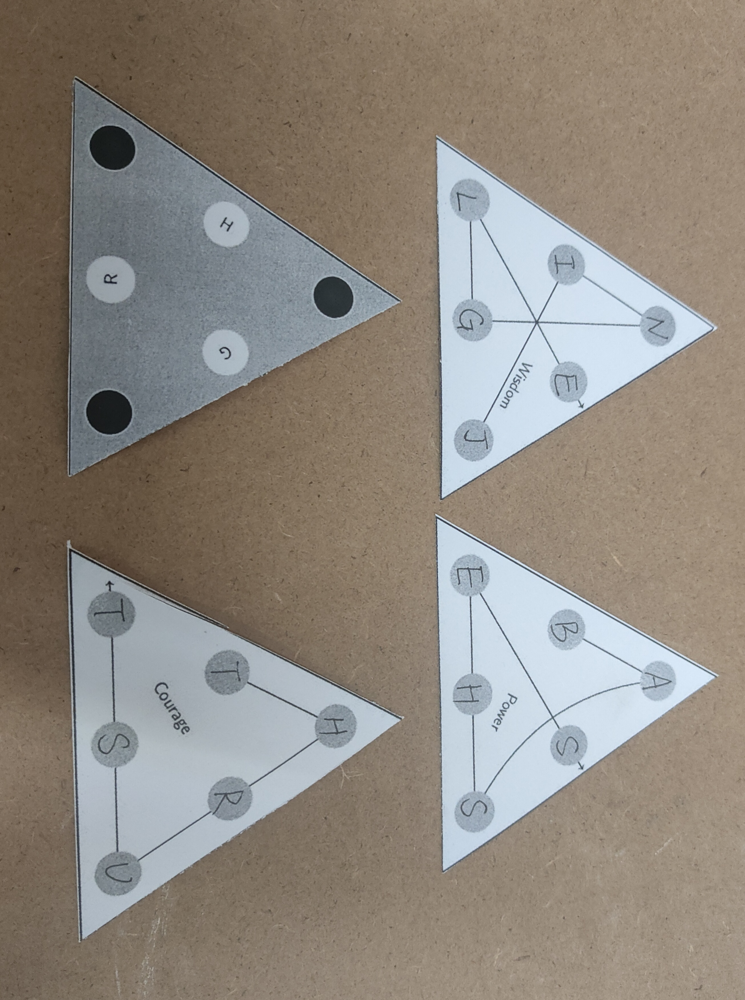
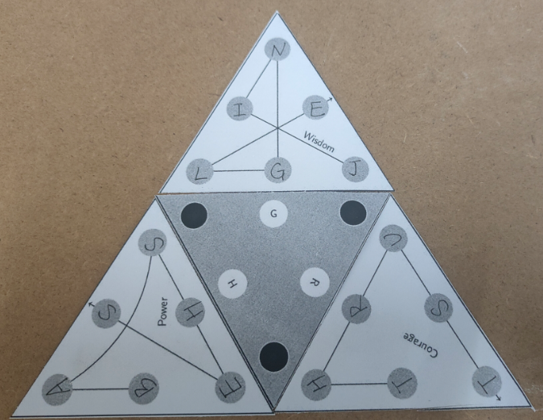

# Writeup: zelda-minihunt

原题：[传送门](https://deusovi.github.io/puzzlefiles/zelda-minihunt.pdf)

## WISDOM

题目很明确地告诉了我们题目与 boggle 有关，但是什么是 boggle？

> Boggle 是一种文字游戏，玩家试图在设定的时间内从字母网格中找到尽可能多的单词
>
> 你可以在[这里](https://cn.puzzle-words.com/daily-boggle/)体验 Boggle 的玩法
>
> 值得注意的是这道题的规则跟 boggle 略有区别，一个字母可以途径多次

那么很快我们就可以把盘面复原，进而可以提取答案

!!! success "答案"
    JINGLE

简洁，朴实无华的题目，不过填字母意外的费时

## POWER

根据 flavor text 的提示，我们得到关键点在于：**weapon**和**add something onto the front**

再结合这些 clue，前进的道路就显而易见了

!!! info "clue 的答案"
    | clue | answer | addition | weapon |
    |------|---------|-----------|--------|
    | State of equilibrium (7) | balance | ba | lance |
    | Look carefully at (7) | examine | exa | mine |
    | Small songbird; Pirates of the Caribbean protagonist's namesake (7) | sparrow | sp | arrow |
    | Japanese ruler of the samurai (6) | shogun | sho | gun |
    | Tent used by Native Americans (6) | teepee | te | epee |
    | Bothering; annoying (8) | hassling | has | sling |

利用右侧的高亮格子提取可得

!!! success "答案"
    BASHES

好题！词汇量是一款我的问题

## COURAGE

典型的迷宫题，我们先按照正常的顺序走一遍

并不意外，再走一次，这次去左上角

好的，我们查一下 dead-end(死胡同处的字母)

好的，我们画一条从 Q 到 Z 的线

!!! success "答案"
    THRUST

## META

第一部自然是把字母填进去。

然后就是拼图了，把字母和中心块的字母对应。

从第一个字母 J 开始，读最外层的一圈，可得最终答案。

==**JUST THE BASS LINE**==